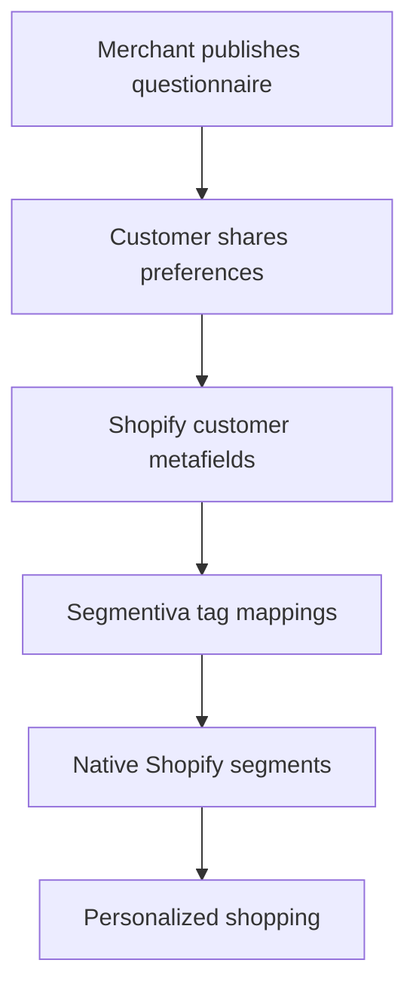

# Segmentiva

**Turn customer data into personalized shopping.**

Segmentiva is a Shopify-native customer preference and segmentation platform. It helps merchants ask shoppers what they care about, store those declared preferences safely in Shopify, and turn the answers into actionable customer tags and native Shopify segments.

> [!NOTE]
> Segmentiva is currently in **pre-alpha planning**. The product specification is complete; application scaffolding and implementation have not started yet.

## The idea

Most stores collect orders, clicks, and sessions but still know very little about what each customer actually wants.

Segmentiva closes that gap with a simple loop:

1. The merchant publishes a short preference questionnaire.
2. The customer completes it after accessing their Shopify account.
3. Segmentiva stores the answers as app-owned customer metafields.
4. Selected answers become namespaced customer tags.
5. Segmentiva creates native Shopify customer segments from those tags.
6. The merchant can use the segments to build more relevant shopping experiences.



## Why Segmentiva

- **Declared preferences:** learn directly from customers instead of relying only on inferred behavior.
- **Shopify-native activation:** use customer metafields, tags, and saved segments that fit existing merchant workflows.
- **No theme-code dependency:** the primary experience uses Shopify Customer Account UI extensions.
- **Privacy by design:** keep customer-level preference data in Shopify and minimize replicated personal data.
- **Built for every merchant:** Kliquea is the first pilot, but the application is multi-tenant and store-agnostic.
- **Expandable foundation:** later releases can add behavioral signals, recommendations, Shopify Flow, and approved marketing integrations.

## MVP

The first release delivers one complete, testable journey.

### Merchant experience

- Embedded Shopify Admin application.
- Guided installation and setup checklist.
- Versioned questionnaire builder.
- Single-select, multi-select, and boolean questions.
- English and Spanish customer-facing labels.
- Mapping from questionnaire options to Segmentiva-owned tags.
- Native Shopify saved-segment creation and synchronization.
- Completion, synchronization, and diagnostic status.
- Privacy, uninstall, and mandatory compliance handling.

### Customer experience

- An invitation on the Shopify customer account order-index page.
- A dedicated customer account preferences page.
- Mobile-first questionnaire with progress and validation.
- Safe editing of previously saved preferences.
- Clear explanation of how preferences improve the shopping experience.
- No forced or preselected marketing consent.

### Initial Kliquea pilot

The default pilot questionnaire covers:

- shopping interests;
- who the customer usually shops for;
- price and quality preferences.

The pilot is seeded through configuration. Kliquea-specific IDs, domains, credentials, categories, or theme details must never be hard-coded.

## Important Shopify limitation

Shopify does not provide a documented extension target inside its native passwordless login or account-creation form.

Segmentiva therefore collects preferences **immediately after the customer's first authenticated account access**. It does not replace Shopify authentication, intercept OTP codes, request passwords, or imitate the native registration screen.

The MVP targets **new Shopify customer accounts**. Classic customer account support is planned for a later storefront-extension phase.

## Planned architecture

Segmentiva begins as a modular monolith: one deployable Shopify application with clear internal domain boundaries.

| Layer | Planned implementation |
| --- | --- |
| Application | Official Shopify React Router template |
| Language | TypeScript in strict mode |
| Merchant UI | Embedded App Home with App Bridge and Shopify web components |
| Customer UI | Two Customer Account UI extensions |
| Shopify APIs | GraphQL Admin API and Customer Account API |
| API baseline | Stable Shopify version `2026-07` |
| Customer data | App-owned Shopify customer metafields |
| Activation | Namespaced customer tags and native saved segments |
| Application data | Prisma with PostgreSQL in shared environments |
| Testing | Vitest, integration tests, and Shopify dev-store validation |
| Delivery model | Provider-neutral Node container with managed PostgreSQL |

### Customer account extensions

Two independent extensions are planned:

- **`segmentiva-preferences-prompt`**  
  Uses `customer-account.order-index.announcement.render` to invite incomplete customers.

- **`segmentiva-preferences-page`**  
  Uses `customer-account.page.render` to display and edit the questionnaire.

### Data flow

Customer preference answers are stored in app-owned metafields using stable internal keys. Segmentiva mirrors only actionable mappings into tags such as:

```text
segmentiva:interests:beauty
segmentiva:shopping_for:gifts
segmentiva:shopping_style:price_quality_balance
segmentiva:profile:complete
```

Those tags power ShopifyQL saved segments such as:

```text
customer_tags CONTAINS 'segmentiva:interests:beauty'
```

Segmentiva only reconciles tags using its own `segmentiva:` namespace and never removes merchant-created tags.

## Privacy and security principles

- Store customer-level preference data primarily in Shopify.
- Do not copy the merchant's customer directory into Segmentiva.
- Do not persist customer names, email addresses, phone numbers, or postal addresses for the MVP.
- Never place customer answers, credentials, access tokens, or raw Shopify payloads in logs.
- Use official Shopify authentication and session libraries.
- Verify customer extension session tokens and webhook HMAC signatures server-side.
- Enforce strict shop-level tenant isolation.
- Request only the minimum protected-customer-data access needed.
- Implement `customers/data_request`, `customers/redact`, and `shop/redact` before pilot completion.
- Never train models on customer answers in the MVP.

## Project status

| Area | Status |
| --- | --- |
| Product name and positioning | Complete |
| MVP product definition | Complete |
| Shopify platform feasibility | Validated |
| Technical architecture | Complete |
| Cursor implementation handoff | Complete |
| Shopify application scaffold | Not started |
| Customer account extensions | Not started |
| Kliquea development-store pilot | Not started |
| Shopify App Store submission | Future phase |

## Start here

The complete implementation specification is:

**[SEGMENTIVA_MVP_BUILD_PLAN.md](./SEGMENTIVA_MVP_BUILD_PLAN.md)**

It contains:

- the authoritative MVP scope;
- platform constraints;
- architecture and data ownership;
- database concepts;
- backend contracts;
- access scopes;
- privacy and security requirements;
- five gated implementation phases;
- acceptance criteria and test strategy;
- six copy-ready execution prompts for Cursor.

### Recommended Cursor workflow

1. Clone the repository.

   ```bash
   git clone https://github.com/cank3r/segmentiva.git
   cd segmentiva
   ```

2. Open the repository in Cursor.
3. Install Shopify's official AI Toolkit through Cursor's `/add-plugin` flow.
4. Read `SEGMENTIVA_MVP_BUILD_PLAN.md` completely.
5. Run **Prompt A — Repository audit and scaffold** from section 24.
6. Complete and verify one phase before starting the next.
7. Keep each phase in a small, reviewable commit.

> [!WARNING]
> Do not run `npm install` or `shopify app dev` yet. The official Shopify application scaffold has not been added to this repository. Phase 0 creates that foundation.

## Implementation phases

| Phase | Outcome |
| --- | --- |
| 0 | Official Shopify React Router scaffold and clean baseline |
| 1 | Tenant model, installation lifecycle, and merchant onboarding |
| 2 | Versioned questionnaire builder |
| 3 | Customer account preference collection |
| 4 | Shopify tags and native segment activation |
| 5 | Privacy, security hardening, CI, and Kliquea pilot readiness |

Work outside the current phase is intentionally deferred.

## Not in MVP 1.0

- custom authentication or OTP handling;
- fields inside Shopify's native sign-up form;
- classic customer account support;
- behavioral Web Pixel collection;
- predictive AI or ML scoring;
- product-ranking or recommendation engine;
- Klaviyo, Meta, Google, HubSpot, or external CDP activation;
- email, SMS, or WhatsApp campaign delivery;
- billing and usage metering;
- bulk customer backfills;
- microservices, queues, Redis, or a data warehouse.

## Roadmap

After the Kliquea MVP proves the core preference-to-segment loop:

1. **Storefront compatibility** — Theme App Extension and classic-account support.
2. **Behavioral signals** — consent-aware Web Pixel events and observed affinities.
3. **Personalization** — recommendation blocks and merchandising rules.
4. **Ecosystem activation** — Shopify Flow and approved marketing integrations.
5. **Commercial release** — billing, self-service onboarding, support tooling, and App Store review.

## Development principles

- Shopify-native before custom infrastructure.
- Stable APIs before release candidates.
- GraphQL Admin API before legacy REST.
- Customer privacy before growth features.
- Explicit preferences before inferred traits.
- Versioned configuration before mutable production state.
- Idempotent synchronization before background scale.
- Modular monolith before microservices.
- Evidence and tests before marking a phase complete.

## Repository

- **Owner:** [cank3r](https://github.com/cank3r)
- **Repository:** [cank3r/segmentiva](https://github.com/cank3r/segmentiva)
- **Primary branch:** `main`
- **Initial pilot:** Kliquea
- **Product direction:** Public Shopify app for any merchant

## License

No open-source license has been selected. Until a license is added, all rights are reserved.
