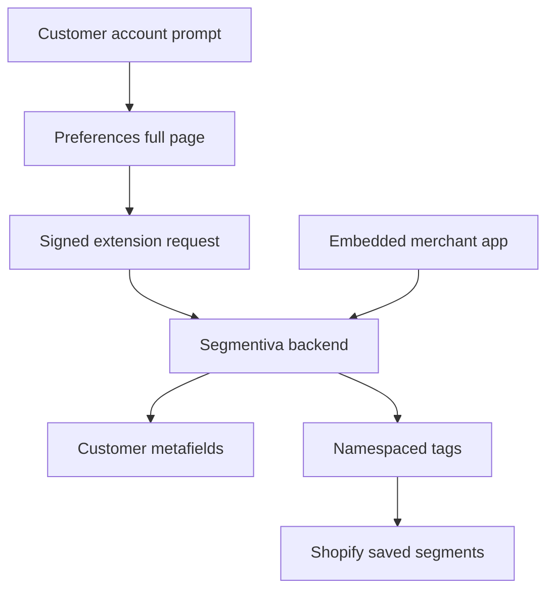

# Segmentiva MVP — Product and Technical Build Plan

> Cursor implementation handoff for `cank3r/segmentiva`

| Field | Value |
| --- | --- |
| Product | Segmentiva |
| Tagline | Turn customer data into personalized shopping. |
| Repository | `cank3r/segmentiva` |
| Document version | 1.0 |
| Date | 2026-09-03 |
| Initial store | Kliquea |
| Distribution goal | Public Shopify app for any merchant |
| Implementation client | Cursor |
| Shopify API baseline | Stable `2026-07` |

## 1. Instructions for Cursor

This document is the source of truth for the first implementation. Read it completely before editing files.

Cursor must:

1. Use Shopify's official React Router app template. Do not hand-build OAuth, embedded-app authentication, session storage, webhook verification, or App Bridge bootstrapping.
2. Use TypeScript in strict mode and the GraphQL Admin API. Do not introduce new REST Admin API integrations.
3. Pin Shopify APIs and customer account extensions to stable version `2026-07`. Do not use `unstable`, `2026-10-rc`, or `LATEST_API_VERSION` in production paths.
4. Use Shopify's official AI Toolkit plugin in Cursor and search Shopify documentation before implementing a Shopify API surface.
5. Implement one phase at a time. Finish its tests and acceptance criteria before starting the next phase.
6. Keep commits small and atomic. Never mix scaffolding, data-model changes, customer UI, and privacy work in one commit.
7. Never commit credentials, access tokens, `.env`, production domains, customer data, or dev-store exports.
8. Preserve the existing `README.md`, updating it only when a phase explicitly requires it.
9. Stop and report a blocker when a required Dev Dashboard permission, protected-customer-data approval, store setting, or merchant placement is missing. Do not create insecure workarounds.
10. Do not implement anything listed under “Out of scope” unless this document is updated first.

## 2. Product definition

Segmentiva is a multi-tenant embedded Shopify app that helps merchants collect declared customer preferences, translate those preferences into usable customer attributes, and activate them through Shopify customer tags and native saved segments.

The first release must solve one complete loop:

1. A merchant installs Segmentiva.
2. The merchant publishes a short preference questionnaire.
3. A customer creates or accesses a Shopify customer account.
4. Segmentiva invites the authenticated customer to complete their preferences.
5. Segmentiva saves the answers as app-owned customer metafields.
6. Segmentiva mirrors actionable classifications to namespaced customer tags.
7. Segmentiva creates or updates native Shopify customer segments from those tags.
8. The merchant can confirm completion, synchronization status, and segment counts from the embedded app.

The first installation will be tested on Kliquea, but no Kliquea-specific domain, store ID, theme name, category ID, or credential may be hard-coded.

## 3. Shopify platform constraint

### 3.1 What the MVP can do

With Shopify's new customer accounts, Segmentiva can render:

- a dismissible prompt on the customer account order-index page through `customer-account.order-index.announcement.render`;
- a dedicated preferences page through `customer-account.page.render`;
- an optional preferences block on the profile page through `customer-account.profile.block.render` in a later iteration.

The order-index page is the normal landing area after a customer accesses a new customer account. The announcement must link to the dedicated Segmentiva preferences page.

### 3.2 What the MVP cannot claim

Shopify does not expose a documented customer-account UI extension target inside the native passwordless sign-in or account-creation form. Segmentiva must not replace Shopify authentication, intercept OTP codes, collect passwords, or present a fake registration page.

Therefore, the correct MVP promise is:

> “Collect preferences immediately after the customer's first authenticated account access.”

It is not:

> “Add arbitrary fields inside Shopify's native registration form.”

This distinction must remain visible in product copy, tests, demos, and App Store materials.

### 3.3 Account compatibility

- Primary MVP target: Shopify **new customer accounts**.
- Classic/legacy customer accounts: explicitly unsupported in MVP 1.0.
- Planned compatibility phase: a Theme App Extension plus signed App Proxy flow, only after the primary experience is stable.

## 4. MVP goals and success metrics

### 4.1 Product goals

- Give a non-technical merchant a working questionnaire without editing theme code.
- Keep the customer questionnaire completable in under 60 seconds.
- Store preference data inside Shopify as the primary customer-level source of truth.
- Avoid storing customer names, email addresses, phone numbers, postal addresses, or raw customer profiles in Segmentiva's database.
- Produce native Shopify segments that merchants can use in Shopify and compatible marketing apps.

### 4.2 Initial operational targets

| Metric | MVP target |
| --- | --- |
| Questionnaire completion time | Under 60 seconds at p75 |
| Preference save success | At least 99% excluding Shopify outages |
| Tag synchronization | Under 30 seconds after save |
| Repeated-save behavior | Idempotent; no duplicate tags or segments |
| Unauthorized cross-shop access | Zero |
| Customer PII in application logs | Zero |
| Mandatory privacy webhook acknowledgment | Valid `2xx` for authentic requests |

Completion rate is measured during the Kliquea pilot and should not be turned into a contractual target until traffic is sufficient.

## 5. MVP scope

### 5.1 Merchant experience

The embedded Admin app must include:

1. **Overview**
   - installation status;
   - customer-account extension status/instructions;
   - questionnaire draft/published status;
   - total completed profiles;
   - last synchronization error count;
   - setup checklist.

2. **Questionnaire**
   - edit title, introduction, completion message, and privacy explanation;
   - create, reorder, enable, disable, and archive questions;
   - create and reorder options;
   - preview the customer experience;
   - publish a version;
   - prevent destructive edits to a previously published version by cloning it into a new draft.

3. **Segments**
   - define a segment name;
   - select the question/option that activates it;
   - preview the tag and ShopifyQL query;
   - publish, resync, disable, or archive the mapping;
   - display the stored Shopify segment GID and last sync state.

4. **Settings**
   - account compatibility state;
   - Shopify API version;
   - requested scopes;
   - privacy/compliance endpoints status;
   - uninstall/data-retention summary;
   - diagnostic connection test that performs a harmless authenticated read.

### 5.2 Customer experience

The customer account experience must include:

1. An order-index announcement shown only when the authenticated customer has not completed the current published questionnaire version.
2. A CTA to open the Segmentiva full-page preferences extension.
3. A mobile-first questionnaire with progress, back, next, skip where allowed, validation, save feedback, error recovery, and a final confirmation.
4. The ability to reopen the page and edit previously saved preferences.
5. Clear disclosure that preferences are used to personalize the shopping experience.
6. No preselected marketing consent. Segmentiva preference consent must not be treated as Shopify email/SMS marketing consent.

### 5.3 Supported question types

MVP question types:

- `single_select`;
- `multi_select`;
- `boolean`.

Not supported in MVP:

- free text;
- date of birth;
- gender identity;
- health, religion, ethnicity, political affiliation, precise location, or other sensitive-trait questions;
- file upload;
- product or collection picker questions exposed to the customer;
- branching logic.

## 6. Kliquea pilot questionnaire

The application must support merchant-created questions. For the first Kliquea seed only, provide a non-hard-coded seed/import action containing:

### Question 1 — What are you interested in?

Type: `multi_select`, at least one option required.

- Beauty
- Women's fashion
- Men's fashion
- Kids
- Home
- Technology
- Health and wellness
- Sports

### Question 2 — Who do you usually shop for?

Type: `multi_select`, optional.

- Myself
- My partner
- Children or family
- Gifts
- My business

### Question 3 — What best describes how you shop?

Type: `single_select`, optional.

- I look for deals
- I balance price and quality
- I prefer premium products
- It depends on the purchase

The labels must be translatable. Internal option keys must be stable ASCII slugs and must not change when a label is translated.

## 7. Architecture decision

### 7.1 Shape

Build a **modular monolith**, not microservices.

One deployable Shopify web application will contain:

- embedded merchant Admin UI;
- server-side Shopify authentication and GraphQL adapters;
- merchant configuration service;
- preference validation and mapping service;
- segment synchronization service;
- webhook handlers;
- two separately generated customer account UI extensions.

This architecture is appropriate for the MVP because it preserves transactional simplicity and lowers operating cost while keeping boundaries that can later be extracted into workers.

### 7.2 Technology baseline

| Layer | Decision |
| --- | --- |
| Language | TypeScript, strict mode |
| Shopify app | Official Shopify React Router template |
| Embedded UI | App Bridge and Shopify web components from the generated template |
| Customer UI | Customer Account UI extensions, Preact/web components, API `2026-07` |
| Shopify API | GraphQL Admin API `2026-07` |
| ORM | Prisma from the official template |
| Local database | Template-supported local database for development only |
| Shared environments | PostgreSQL |
| Validation | Zod or the validation library already present in the official scaffold |
| Tests | Vitest for unit/integration; Playwright only where reliable end-to-end coverage is possible |
| Deployment | Node-compatible container plus managed PostgreSQL; provider selected after local MVP acceptance |

Do not replace a library selected by Shopify's current official template unless there is a documented incompatibility.

### 7.3 High-level flow



### 7.4 Required customer extensions

Generate two separate customer account extensions:

1. `segmentiva-preferences-prompt`
   - target: `customer-account.order-index.announcement.render`;
   - reads completion state;
   - links to the full-page extension;
   - hides itself after the current questionnaire version is complete.

2. `segmentiva-preferences-page`
   - target: `customer-account.page.render`;
   - loads published questionnaire configuration;
   - reads current preferences;
   - submits validated answers;
   - supports later editing.

A Shopify full-page customer account target cannot coexist with unrelated targets in the same extension configuration. Keep these as separate extension directories.

## 8. Data ownership and storage

### 8.1 Source-of-truth rule

- Shopify customer app-owned metafields are the customer-level source of truth.
- Segmentiva PostgreSQL stores merchant configuration, questionnaire definitions, mapping rules, Shopify resource IDs, synchronization state, and non-PII audit metadata.
- Segmentiva must not copy the merchant's customer directory into PostgreSQL for the MVP.
- Aggregate counts may be cached if they cannot be traced back to an identifiable customer.

### 8.2 Customer metafields

Create app-owned customer metafield definitions declaratively in app configuration when supported by the scaffold.

Required logical fields:

| Logical key | Type | Purpose |
| --- | --- | --- |
| `preferences` | JSON | Stable question keys mapped to option keys |
| `questionnaire_version` | Integer/string | Version used to interpret the answers |
| `completed_at` | Date-time | Last successful completion time |
| `profile_status` | Single-line string | `not_started`, `partial`, or `complete` |

Use an app-reserved namespace, conceptually `$app:segmentiva`. Cursor must verify the exact current TOML syntax using Shopify's documentation before implementation.

Do not store labels in the answer payload. Store stable keys so translations and copy edits do not corrupt segmentation.

Example conceptual payload:

```json
{
  "interests": ["beauty", "home"],
  "shopping_for": ["self", "gifts"],
  "shopping_style": "price_quality_balance"
}
```

### 8.3 Customer tags

Tags are the Shopify-native activation mirror, not the primary data model.

Format:

```text
segmentiva:<question-key>:<option-key>
```

Examples:

```text
segmentiva:interests:beauty
segmentiva:interests:home
segmentiva:shopping_for:gifts
segmentiva:shopping_style:price_quality_balance
segmentiva:profile:complete
```

Rules:

- Add only tags generated by active published mappings.
- Remove stale Segmentiva tags when an answer changes.
- Never remove or rewrite merchant-created tags or tags owned by another app.
- Normalize keys when configuration is created, not during every save.
- Repeating the same preference save must produce no tag changes.

### 8.4 Native Shopify segments

Use `segmentCreate`/segment management through GraphQL Admin API to create saved segments based on namespaced customer tags.

Conceptual query:

```text
customer_tags CONTAINS 'segmentiva:interests:beauty'
```

Names:

```text
Segmentiva · Interested in Beauty
Segmentiva · Shops for Gifts
```

Each mapping record must keep the returned Shopify Segment GID. Publishing and resynchronizing must be idempotent. If the merchant deletes a generated segment in Shopify, Segmentiva must detect the missing resource and offer recreation instead of silently creating duplicates.

## 9. Application database model

The exact Prisma syntax is an implementation detail, but the domain model must include these concepts:

### `Shop`

- Shopify shop domain as unique tenant key;
- installation state;
- installed/uninstalled timestamps;
- settings JSON for non-sensitive preferences;
- current published questionnaire ID/version;
- created/updated timestamps.

Use the official template's session model for Shopify tokens. Do not duplicate tokens in `Shop`.

### `Questionnaire`

- ID;
- shop ID;
- version;
- status: `DRAFT`, `PUBLISHED`, `ARCHIVED`;
- default locale;
- title, introduction, completion copy, privacy copy;
- published timestamp;
- created/updated timestamps;
- unique `(shopId, version)`.

### `Question`

- ID;
- questionnaire ID;
- stable key;
- type;
- position;
- required flag;
- translatable label/help text JSON;
- status.

### `Option`

- ID;
- question ID;
- stable key;
- position;
- translatable label JSON;
- status.

### `SegmentMapping`

- ID;
- shop ID;
- question key;
- option key;
- generated tag;
- merchant-facing segment name;
- Shopify Segment GID, nullable until published;
- sync status and last error code;
- enabled flag;
- created/updated timestamps;
- unique `(shopId, questionKey, optionKey)`.

### `SyncEvent`

- ID;
- shop ID;
- operation type;
- resource type;
- non-PII resource reference or one-way digest where necessary;
- status;
- retry count;
- safe error code/message with secrets and customer answers removed;
- timestamps.

### `AuditEvent`

- ID;
- shop ID;
- merchant action;
- actor type, not raw customer identity;
- target type and ID;
- safe before/after metadata;
- timestamp.

Do not add a `Customer`, `CustomerProfile`, `CustomerEmail`, or raw `Submission` table in the MVP without an approved architecture change and privacy review.

## 10. Backend contracts

Route names may follow the generated React Router conventions, but the logical contracts must be preserved.

### Merchant-authenticated routes

- `GET /app` — overview loader.
- `GET/POST /app/questionnaire` — draft editor and actions.
- `POST /app/questionnaire/publish` — validate and publish immutable version.
- `GET/POST /app/segments` — mapping management.
- `POST /app/segments/:id/sync` — idempotent Shopify segment synchronization.
- `GET /app/settings` — scopes, version, privacy, and diagnostics.

All merchant routes must use the official template's `authenticate.admin(request)` path and enforce shop tenancy server-side.

### Customer-extension routes

- `GET /api/customer/questionnaire` — published configuration plus current completion state.
- `GET /api/customer/preferences` — current values for editing.
- `PUT /api/customer/preferences` — validate, save metafields, reconcile tags, and return completion state.

Requirements:

- Obtain a fresh customer account extension session token immediately before each backend request.
- Send it as `Authorization: Bearer <token>`.
- Verify signature, expiration, not-before, audience, destination shop, and nonce/replay characteristics using Shopify-supported primitives.
- Require the `sub` customer GID claim for customer-specific routes.
- Resolve the installation by the verified destination shop.
- Never trust a customer ID, shop domain, tag, question key, or option key supplied independently by the browser when the verified token already provides authority/context.
- Return structured errors without leaking secrets or Shopify payloads.

Suggested response envelope:

```json
{
  "ok": false,
  "error": {
    "code": "INVALID_OPTION",
    "message": "One or more selections are no longer available."
  }
}
```

### Preference write transaction

The logical operation is:

1. Authenticate customer extension request.
2. Load current published questionnaire for the verified shop.
3. Validate question keys, option keys, cardinality, required fields, and questionnaire version.
4. Read previous Segmentiva preference metafields/tags.
5. Write the new app-owned metafields.
6. Reconcile only Segmentiva-owned customer tags.
7. Record a safe sync event.
8. Return the saved normalized payload and completion state.

If metafield persistence fails, do not change tags. If tag reconciliation fails after metafield persistence, return a recoverable partial-sync status and make a safe retry possible. Never ask the customer to resubmit repeatedly to repair internal state.

## 11. Shopify access scopes

Start with the minimum required scopes and confirm exact names against the generated API version.

Expected Admin scopes:

- `read_customers`;
- `write_customers`.

Expected Customer Account API scopes for direct customer metafield access:

- `customer_read_customers`;
- `customer_write_customers`.

Do not request orders, products, inventory, discounts, marketing events, checkout, themes, or analytics scopes in the MVP unless a reviewed requirement proves they are necessary.

The application will need protected customer data approval because it identifies an authenticated customer and writes customer-level data. Request only the minimum data fields. The MVP must not request access to name, email, phone, or address fields.

## 12. Privacy and compliance

### 12.1 Mandatory compliance webhooks

Implement and verify:

- `customers/data_request`;
- `customers/redact`;
- `shop/redact`.

Also handle:

- `app/uninstalled`;
- relevant app-scope/update events if required by the official template.

Authentic compliance requests receive a `2xx` acknowledgment. Invalid HMAC requests receive `401`. The required privacy action must complete within Shopify's required time window.

### 12.2 Deletion behavior

- `customers/data_request`: identify which app-owned customer metafields/preferences are held and provide the merchant with the required export workflow. Do not expose another customer's data.
- `customers/redact`: delete or blank Segmentiva app-owned customer preference metafields and remove Segmentiva-owned tags when Shopify permits the operation; delete any corresponding customer-linked sync metadata.
- `shop/redact`: delete merchant configuration, sessions, mappings, tokens, audit data not legally retained, and all customer-linked references for that shop.
- `app/uninstalled`: revoke active processing, mark the shop uninstalled, stop jobs, and begin the documented retention workflow. Do not immediately assume the same timing as `shop/redact`.

### 12.3 Privacy principles

- Data minimization by default.
- Purpose limitation: use answers only for merchant-authorized personalization/segmentation.
- No sale or cross-merchant sharing of customer data.
- No model training on customer answers in the MVP.
- No customer answers in logs, analytics events, exception traces, or support screenshots.
- Do not infer sensitive traits.
- Respect applicable consent decisions.
- Provide merchant-facing privacy documentation before App Store submission.

## 13. Security requirements

- Use official Shopify authentication/session libraries.
- Verify every webhook HMAC before parsing business data.
- Verify customer account extension session tokens server-side.
- Enforce strict tenant isolation in every database query through verified shop identity.
- Store tokens only through the template session storage and encrypt production storage at rest.
- Use secret management in deployed environments; never expose secrets to extension bundles.
- Validate all inputs server-side even if the extension validates them.
- Apply request body size limits and sane rate limits.
- Use idempotency for publish, save, sync, webhook, and retry operations.
- Redact secrets, tokens, answers, email addresses, and raw GraphQL payloads from logs.
- Do not expose GraphQL Admin API access tokens to the browser.
- Set secure headers and exact CORS/origin rules based on Shopify's documented extension requirements.
- Keep dependencies patched and enable automated dependency/security checks in CI.

## 14. Reliability and Shopify API behavior

- Centralize Admin GraphQL calls in typed adapters.
- Inspect GraphQL `userErrors`; an HTTP `200` is not sufficient for success.
- Respect Shopify throttling and `extensions.cost.throttleStatus`.
- Retry only retryable errors with bounded exponential backoff and jitter.
- Do not retry validation, authorization, HMAC, or permanent GraphQL user errors.
- Use cursors for all paginated queries.
- Make webhook handling idempotent using delivery IDs where available.
- Avoid bulk customer reads in the MVP.

## 15. UI and content requirements

### Merchant UI

- Use Shopify-native web components and App Design Guidelines.
- Provide clear empty, loading, success, error, permission-missing, and disconnected states.
- Never display raw GIDs or GraphQL errors as the primary message; place technical IDs only in a diagnostic detail.
- Destructive actions require confirmation.
- Publishing must show what will change and which Shopify segments will be created/updated.

### Customer UI

- Mobile-first and keyboard accessible.
- Use only customer account extension components allowed for API `2026-07`.
- Clear progress and validation.
- Save button disabled during submission.
- Graceful retry without losing selections.
- No deceptive urgency, forced marketing consent, or dark patterns.
- Translate all visible customer copy; start with English and Spanish.

## 16. Repository target structure

The official template may evolve. Preserve its generated conventions while reaching this logical structure:

```text
segmentiva/
├── app/
│   ├── routes/
│   ├── services/
│   │   ├── questionnaire/
│   │   ├── preferences/
│   │   ├── segmentation/
│   │   ├── shopify/
│   │   └── privacy/
│   ├── repositories/
│   ├── validators/
│   └── shopify.server.ts
├── extensions/
│   ├── segmentiva-preferences-prompt/
│   └── segmentiva-preferences-page/
├── prisma/
│   ├── schema.prisma
│   └── migrations/
├── tests/
│   ├── unit/
│   ├── integration/
│   └── fixtures/
├── docs/
├── .env.example
├── shopify.app.toml
├── package.json
├── README.md
└── SEGMENTIVA_MVP_BUILD_PLAN.md
```

Do not create generic `utils` dumping grounds. Domain logic belongs in named services and pure functions; Shopify transport logic belongs in adapters.

## 17. Development setup for Cursor

### 17.1 Local prerequisites

- Git;
- Node.js 22 or newer;
- npm, pnpm, yarn, or bun supported by the current Shopify template;
- Shopify CLI latest;
- Shopify developer account and development store;
- Cursor Shopify AI Toolkit plugin.

Install Shopify CLI only if `shopify version` is unavailable:

```bash
npm install -g @shopify/cli@latest
```

In Cursor, install Shopify's plugin through `/add-plugin` and search for **Shopify**.

### 17.2 Scaffolding rule for this existing repository

The repository already contains `README.md`. Do not initialize a nested application accidentally.

Preferred safe procedure:

1. Clone `cank3r/segmentiva`.
2. Create the official React Router Shopify app scaffold in a temporary sibling directory using `shopify app init`.
3. Confirm that the scaffold runs unchanged.
4. Move/merge the generated scaffold into the repository root while preserving this document and the existing README content.
5. Confirm there is only one `package.json`, one Git repository, and no nested `segmentiva/segmentiva` directory.
6. Delete the temporary scaffold only after the merged repository runs.

Do not recreate the generated authentication code manually.

### 17.3 Environment variables

Commit only `.env.example` with names and safe descriptions. Expected categories:

- Shopify API key and secret;
- Shopify application URL;
- requested scopes/config generated by Shopify CLI;
- database URL;
- optional structured logging/error-reporting settings.

Never put real values in documentation, fixtures, screenshots, or commits.

## 18. Implementation phases

### Phase 0 — Official scaffold and baseline

Deliverables:

- official React Router scaffold merged into repository root;
- app linked to the Segmentiva app record in Shopify Dev Dashboard;
- stable API version pinned to `2026-07`;
- local development starts with `shopify app dev`;
- embedded Admin home loads in a dev store;
- baseline lint, typecheck, and test commands pass;
- `.env.example`, `.gitignore`, and updated README setup instructions;
- no Segmentiva business logic yet.

Acceptance criteria:

- install/reinstall succeeds;
- OAuth/session handling comes from the official template;
- no nested project;
- no credentials committed;
- clean checkout can install dependencies and run validation commands.

Suggested commit:

```text
feat: scaffold Segmentiva Shopify app
```

### Phase 1 — Tenant model and merchant onboarding

Deliverables:

- PostgreSQL-ready Prisma schema for `Shop` plus official sessions;
- install/uninstall lifecycle;
- overview/setup checklist;
- settings/diagnostics page;
- shop-scoped repository/service pattern;
- seed/import command for the Kliquea pilot questionnaire, disabled for other shops unless explicitly invoked.

Acceptance criteria:

- two dev stores cannot read or modify each other's records;
- reinstall behaves predictably;
- diagnostic read identifies the verified current shop without exposing a token;
- uninstall stops application processing.

Suggested commit:

```text
feat: add tenant onboarding and installation lifecycle
```

### Phase 2 — Questionnaire builder

Deliverables:

- questionnaire/question/option Prisma models and migrations;
- draft editor;
- validation and stable key generation;
- reordering;
- draft preview;
- immutable versioned publish flow;
- English/Spanish label structure;
- unit tests for validation and publish cloning.

Acceptance criteria:

- duplicate keys rejected within their scope;
- published versions cannot be mutated in place;
- archived options remain interpretable for prior saved answers;
- invalid/empty required questions cannot be published;
- Kliquea seed produces the exact logical questions in section 6.

Suggested commit:

```text
feat: add versioned preference questionnaire builder
```

### Phase 3 — Customer account preference collection

Deliverables:

- separate prompt and full-page customer account extensions;
- extension session-token authentication;
- published questionnaire API;
- read/edit current answers;
- app-owned customer metafield definitions;
- validated preference write flow;
- bilingual customer UI;
- loading, empty, success, partial-sync, and retry states.

Acceptance criteria:

- unauthenticated calls fail safely;
- a token for Shop A cannot act on Shop B;
- the prompt hides after completion of the current version;
- a newly published version can prompt the customer again without destroying prior interpretable data;
- no name, email, phone, or address is persisted by Segmentiva;
- refresh shows saved answers.

Suggested commit:

```text
feat: collect customer preferences in account extensions
```

### Phase 4 — Tags and Shopify native segments

Deliverables:

- mapping editor;
- deterministic namespaced tag generator;
- safe tag reconciliation;
- native segment create/update/recreate flow;
- sync status UI;
- throttling and bounded retry handling;
- unit/integration tests.

Acceptance criteria:

- answer changes remove only obsolete Segmentiva tags;
- repeated saves are idempotent;
- segment sync never creates duplicate saved segments for the same mapping;
- deleting a generated segment in Shopify produces a visible recoverable state;
- Shopify `userErrors` are handled and surfaced safely.

Suggested commit:

```text
feat: activate preferences through tags and segments
```

### Phase 5 — Privacy, hardening, and pilot readiness

Deliverables:

- all mandatory compliance webhooks;
- invalid-HMAC tests;
- customer and shop deletion workflows;
- safe structured logging;
- retry/idempotency tests;
- security review checklist;
- GitHub Actions for install, lint, typecheck, unit tests, and migration validation;
- Kliquea pilot runbook;
- merchant installation/extension-placement guide.

Acceptance criteria:

- privacy webhook fixtures pass;
- no sensitive values appear in logs or test snapshots;
- a full test customer journey succeeds in Kliquea's development environment;
- all repository checks pass from a clean checkout;
- remaining App Store blockers are documented explicitly.

Suggested commit:

```text
chore: harden Segmentiva for Kliquea pilot
```

## 19. Test strategy

### Unit tests

- questionnaire validation;
- stable key normalization;
- allowed answer cardinality;
- preference normalization;
- generated tag format;
- old/new tag diff;
- completion-state calculation;
- Shopify GraphQL `userErrors` mapping;
- retry classification;
- privacy redaction helpers.

### Integration tests

- merchant authentication boundary with official test helpers;
- tenant-scoped database access;
- publish transaction;
- preference write orchestration with mocked Shopify GraphQL;
- tag reconciliation partial failure;
- segment create/update/recreate idempotency;
- valid and invalid webhook HMAC fixtures;
- customer session token verification fixtures without real secrets.

### Manual Shopify dev-store tests

1. Install the app.
2. Open embedded Admin UI.
3. Import or create the Kliquea pilot questionnaire.
4. Publish the questionnaire.
5. Add both extensions through the checkout/accounts editor when required.
6. Create a test customer through Shopify.
7. Complete OTP authentication.
8. Confirm the order-index prompt appears.
9. Open the preference page and save answers.
10. Refresh and confirm answers persist.
11. Confirm expected app-owned metafields and only expected namespaced tags exist.
12. Confirm native saved-segment membership.
13. Edit preferences and confirm stale tags/membership are reconciled.
14. Repeat the same save and confirm no duplicates.
15. Test expired/invalid token behavior.
16. Test simulated GraphQL throttle/retry behavior.
17. Trigger uninstall and privacy webhook fixtures.

Do not use real customer accounts or production customer exports during development.

## 20. Definition of done for MVP 1.0

The MVP is done only when:

- all five implementation phases meet their acceptance criteria;
- the app runs from a clean clone using documented steps;
- Kliquea can install it in a development/test context;
- an authenticated test customer can complete and edit preferences;
- customer metafields, tags, and native segments remain consistent;
- protected customer data requirements and mandatory compliance webhooks are implemented;
- no secret or real customer data exists in Git history;
- CI passes;
- known limitations are documented;
- Carlos approves the Kliquea pilot behavior.

## 21. Out of scope for MVP 1.0

- injecting fields into Shopify's native login/registration form;
- custom authentication or OTP handling;
- classic customer account support;
- product recommendation engine;
- personalized home, collection, search, or PDP ranking;
- Web Pixels behavioral collection;
- predictive AI/ML scoring;
- Klaviyo, Meta, Google, HubSpot, or external CDP activation;
- email/SMS/WhatsApp campaigns;
- automatic discounting;
- billing and pricing plans;
- usage metering;
- bulk customer backfill/import;
- multi-store enterprise organization views;
- A/B testing;
- mobile app SDK;
- microservices, queues, Redis, or a data warehouse unless production evidence requires them.

## 22. Post-MVP roadmap

### 1.1 — Storefront and classic-account compatibility

- Theme App Extension prompt/block;
- signed App Proxy submission;
- legacy customer-account compatibility;
- merchant-configurable placement and styling.

### 1.2 — Behavioral signals

- Web Pixel events only after consent architecture review;
- Customer Privacy API integration;
- declared versus observed-interest model;
- event retention and aggregation policy.

### 1.3 — Personalization activation

- product/collection affinity scoring;
- storefront recommendation blocks;
- personalized merchandising rules;
- holdout groups and measurable uplift.

### 1.4 — Ecosystem activation

- Shopify Flow actions/triggers;
- Klaviyo/Meta/Google audience sync;
- webhooks and APIs for approved external tools;
- merchant-controlled data export.

### 2.0 — Commercial public app

- billing plans and usage limits;
- App Store listing and review package;
- full self-service onboarding;
- support diagnostics;
- production SLOs, incident response, and data processing documentation;
- scalable background job architecture if measured load requires it.

## 23. Risks and mitigations

| Risk | Impact | Mitigation |
| --- | --- | --- |
| Expectation of fields inside native signup | Product appears incomplete | Use accurate “after first authenticated access” promise and demo |
| Merchant does not place/enable extension | Customers never see prompt | Setup checklist, placement instructions, status detection where supported |
| Protected-customer-data approval delayed | Customer identification blocked | Request minimum level early; never request contact fields |
| Merchant edits/deletes generated Shopify segment | Drift or duplicates | Store GID, detect missing resource, explicit recreate action |
| Tag collisions | Other automation affected | Reserve `segmentiva:` prefix and touch only exact owned tags |
| GraphQL throttling | Delayed saves/sync | Cost-aware operations, bounded retry, partial-sync recovery |
| Questionnaire edits invalidate old answers | Incorrect segmentation | Immutable published versions and stable keys |
| Cross-tenant bug | Severe privacy breach | Verified shop context, shop-scoped repositories, negative tests |
| Customer answers leak to logs | Privacy/security breach | Structured redaction and test assertions |
| Scope creep into recommendation engine | MVP delay | Enforce out-of-scope list and phase gates |

## 24. Cursor execution prompts

Run these prompts one at a time. Do not paste all phases into a single Cursor request.

### Prompt A — Repository audit and scaffold

```text
Read SEGMENTIVA_MVP_BUILD_PLAN.md completely. Inspect the repository and summarize the current state, required local prerequisites, and exact Phase 0 implementation plan. Use the installed Shopify AI Toolkit to verify the current official React Router scaffold process and stable 2026-07 configuration. Do not edit files until you have shown the plan. Then implement Phase 0 only, preserving README content, avoiding a nested project, and run every available lint, typecheck, and test command. Report changed files, commands, results, blockers, and the proposed atomic commit. Do not start Phase 1.
```

### Prompt B — Tenant foundation

```text
Read SEGMENTIVA_MVP_BUILD_PLAN.md and verify Phase 0 is complete and clean. Implement Phase 1 only: tenant model, official session persistence, install/uninstall lifecycle, overview checklist, settings diagnostics, strict shop isolation, and the explicit Kliquea seed action. Do not implement questionnaire editing or customer extensions yet. Add tests for cross-shop isolation and lifecycle behavior. Run lint, typecheck, tests, and migrations, then report evidence against every Phase 1 acceptance criterion.
```

### Prompt C — Questionnaire builder

```text
Read SEGMENTIVA_MVP_BUILD_PLAN.md and verify Phases 0–1. Implement Phase 2 only using Shopify-native Admin UI components: versioned draft/publish questionnaire model, questions, options, ordering, validation, preview, translations structure, and Kliquea seed. Published versions must be immutable and stable keys must survive label changes. Add unit/integration tests and report evidence against every Phase 2 acceptance criterion. Do not generate customer account extensions yet.
```

### Prompt D — Customer account extensions

```text
Read SEGMENTIVA_MVP_BUILD_PLAN.md and verify Phases 0–2. Use Shopify documentation through the Shopify AI Toolkit before coding. Implement Phase 3 only. Generate two separate customer account UI extensions for stable API 2026-07: the order-index announcement prompt and the customer-account full page. Implement server-side verification of fresh customer account session tokens, published questionnaire loading, app-owned customer metafield definitions, validated read/write/edit flows, bilingual UI, and safe error states. Do not create custom authentication or modify Shopify's native OTP/sign-in form. Add tests and report evidence against every Phase 3 acceptance criterion.
```

### Prompt E — Segmentation activation

```text
Read SEGMENTIVA_MVP_BUILD_PLAN.md and verify Phases 0–3. Implement Phase 4 only: mapping UI, deterministic segmentiva-prefixed tags, exact owned-tag reconciliation, Shopify GraphQL saved-segment create/update/recreate flows, idempotency, throttling handling, safe retries, status UI, and tests. Do not add external marketing integrations or recommendation logic. Report evidence against every Phase 4 acceptance criterion.
```

### Prompt F — Privacy and pilot hardening

```text
Read SEGMENTIVA_MVP_BUILD_PLAN.md and verify Phases 0–4. Implement Phase 5 only: customers/data_request, customers/redact, shop/redact, app/uninstalled handling, HMAC verification and invalid-HMAC tests, deletion workflows, safe structured logging, security checks, GitHub Actions, Kliquea pilot runbook, and merchant extension-placement documentation. Run the full clean-checkout validation suite and report evidence against every Phase 5 acceptance criterion and the MVP definition of done. Do not begin post-MVP work.
```

## 25. Required reference documentation

Cursor must verify implementation details against current Shopify documentation, especially:

- Shopify app scaffolding and React Router template;
- Shopify app React Router authentication;
- Customer Account UI extension targets for API `2026-07`;
- customer account extension Session Token API;
- customer metafield definitions and metafield writes;
- customer segment management and segment query language;
- protected customer data requirements;
- mandatory privacy compliance webhooks;
- Shopify App Store review requirements.

If current stable documentation contradicts this file, Cursor must stop, quote/link the authoritative Shopify page, explain the impact, and propose a document change before implementing the affected feature.

